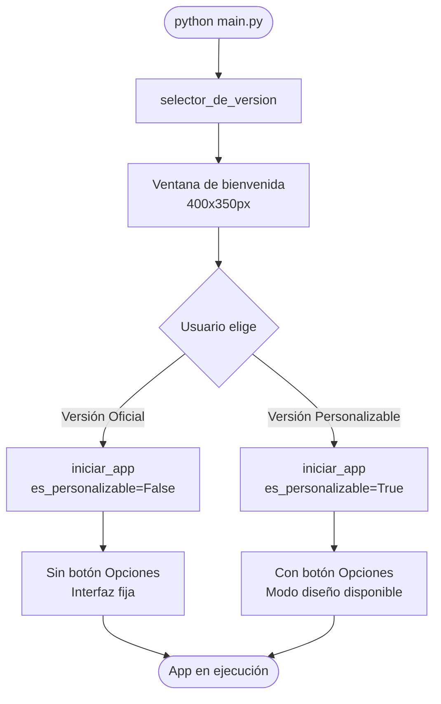

# CALCULOTOKENS — Visión General del Proyecto

> **Versión:** 1.0.0 | **Lenguaje:** Python 3.10+ | **Tipo:** Aplicación de escritorio (GUI)  
> Herramienta local para estimar tokens y costes de llamadas a APIs de IA sin realizar llamadas reales.

---

## Índice

1. [Descripción](#1-descripción)
2. [Arquitectura](#2-arquitectura)
3. [Estructura de directorios](#3-estructura-de-directorios)
4. [Flujo de arranque — main.py](#4-flujo-de-arranque--mainpy)
5. [Instalación y ejecución](#5-instalación-y-ejecución)
6. [Dependencias](#6-dependencias)
7. [Mapa de documentación](#7-mapa-de-documentación)

---

## 1. Descripción

**CALCULOTOKENS** es una aplicación de escritorio con interfaz gráfica que permite:

- Estimar tokens de un texto para distintos modelos de IA (OpenAI, Anthropic, Google).
- Calcular el coste aproximado de una llamada a API en USD y EUR.
- Personalizar visualmente la interfaz en el modo Versión Personalizable.

> La aplicación **no realiza llamadas reales** a ninguna API externa. Todo el procesamiento es local.

---

## 2. Arquitectura

El proyecto sigue el patrón **Layered Architecture**, con tres capas claramente separadas:

```
┌───────────────────────────────────────┐
│            UI Layer                   │
│  ui/app.py · ui/componentes.py        │
│  ui/editor.py · main.py              │
├───────────────────────────────────────┤
│          Service Layer                │
│   servicios/calculo_servicio.py       │
├───────────────────────────────────────┤
│            Core Layer                 │
│  core/calculadora.py · core/tokens.py │
│  core/precios.py                      │
└───────────────────────────────────────┘
```

**Regla fundamental:**  
`UI → Servicios → Core`  
Nunca al revés. Nunca saltando capas.

---

## 3. Estructura de directorios

```
CALCULOTOKENS/
│
├── core/                        # Lógica de negocio pura
│   ├── __init__.py
│   ├── calculadora.py           # Clase CalculadoraCostes
│   ├── precios.py               # Diccionario PRECIOS_MODELOS
│   └── tokens.py                # Función estimar_tokens()
│
├── documentacion/               # Docs internas del equipo
│   ├── errores.md
│   └── Separacion_codigo.md
│
├── servicios/                   # Orquestación entre UI y core
│   └── calculo_servicio.py
│
├── tests/                       # Suite de pruebas con pytest
│   └── test_calculo.py
│
├── ui/                          # Interfaz gráfica (customtkinter)
│   ├── __init__.py
│   ├── app.py
│   ├── componentes.py
│   └── editor.py
│
├── utils/                       # Utilidades transversales
│   ├── __init__.py
│   └── formateo.py              # (vacío — reservado)
│
├── main.py                      # Punto de entrada
├── README.md
└── requisitos.txt
```

---

## 4. Flujo de arranque — `main.py`

`main.py` es el único punto de entrada de la aplicación. Muestra una ventana de selección de versión antes de lanzar la interfaz principal.

### Función: `selector_de_version`

Crea una ventana CTk (`400×350px`) con dos botones que determinan el modo de la app:

| Botón                  | Acción                                  |
|------------------------|-----------------------------------------|
| Versión Oficial        | `iniciar_app(es_personalizable=False)`  |
| Versión Personalizable | `iniciar_app(es_personalizable=True)`   |

### Diagrama de arranque



---

## 5. Instalación y ejecución

### Requisitos del sistema

- Python 3.10 o superior
- Windows, macOS o Linux

### Instalación

```bash
# Clonar o descomprimir el proyecto
cd CALCULOTOKENS

# Instalar dependencias
pip install -r requisitos.txt

# Instalar tiktoken (no está en requisitos.txt pero es necesario)
pip install tiktoken
```

### Ejecución

```bash
python main.py
```

---

## 6. Dependencias

| Paquete        | Uso                                          | En requisitos.txt |
|----------------|----------------------------------------------|:-----------------:|
| `customtkinter`| Framework de interfaz gráfica moderna        | ✅                |
| `tiktoken`     | Estimación de tokens (librería de OpenAI)    | ❌ _(pendiente)_  |
| `pytest`       | Framework de testing                         | ✅                |
| `pytest-cov`   | Cobertura de tests                           | ✅                |

> ⚠️ **Acción requerida:** Añadir `tiktoken` a `requisitos.txt` para evitar errores de importación en instalaciones limpias.

---

## 7. Mapa de documentación

Cada capa del proyecto tiene su propio documento de referencia:

| Documento       | Cubre                                              |
|-----------------|----------------------------------------------------|
| `core.md`       | `core/precios.py`, `core/tokens.py`, `core/calculadora.py` |
| `servicios.md`  | `servicios/calculo_servicio.py`                    |
| `ui.md`         | `ui/app.py`, `ui/componentes.py`, `ui/editor.py`  |
| `tests.md`      | `tests/test_calculo.py`, ejecución y cobertura     |
| `utils.md`      | `utils/formateo.py` (reservado para uso futuro)    |