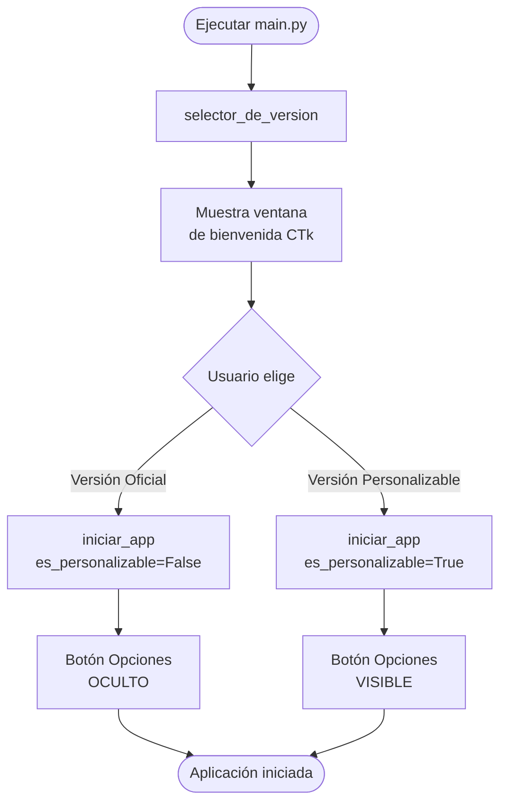
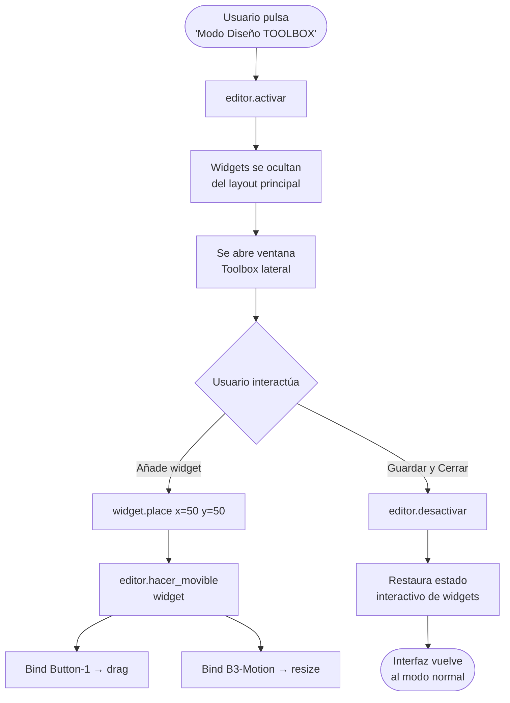
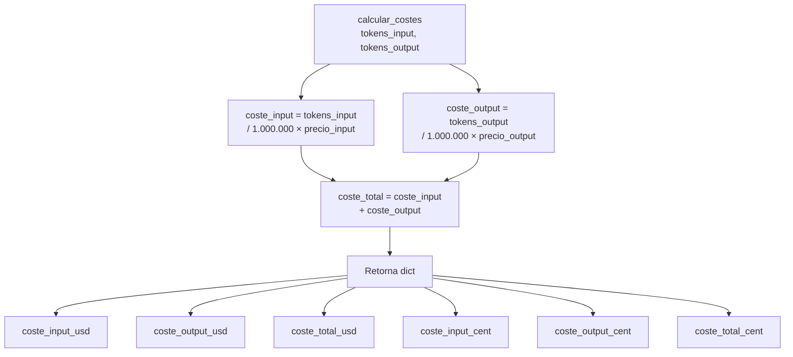

# CALCULOTOKENS — Documentación Técnica

> **Versión:** 1.0.0  
> **Lenguaje:** Python 3.10+  
> **Tipo:** Aplicación de escritorio (GUI)  
> **Propósito:** Estimación de tokens y costes para múltiples proveedores de IA (OpenAI, Anthropic, Google)

---

## Índice

1. [Descripción General](#1-descripción-general)
2. [Arquitectura del Proyecto](#2-arquitectura-del-proyecto)
3. [Estructura de Directorios](#3-estructura-de-directorios)
4. [Flujos de Datos](#4-flujos-de-datos)
5. [Referencia de Módulos](#5-referencia-de-módulos)
   - 5.1 [core/](#51-core)
   - 5.2 [servicios/](#52-servicios)
   - 5.3 [ui/](#53-ui)
   - 5.4 [utils/](#54-utils)
   - 5.5 [tests/](#55-tests)
6. [Instalación y Ejecución](#6-instalación-y-ejecución)
7. [Modelos Soportados y Precios](#7-modelos-soportados-y-precios)
8. [Guía de Errores Conocidos](#8-guía-de-errores-conocidos)
9. [Decisiones de Diseño](#9-decisiones-de-diseño)
10. [Roadmap y Mejoras Pendientes](#10-roadmap-y-mejoras-pendientes)

---

## 1. Descripción General

**CALCULOTOKENS** es una aplicación de escritorio con interfaz gráfica (GUI) desarrollada en Python que permite:

- Estimar el número de tokens que consume un texto dado para distintos modelos de IA.
- Calcular el coste aproximado en USD y EUR de una llamada a API, tanto para tokens de entrada (_input_) como de salida (_output_).
- Personalizar visualmente la interfaz (tipografía, colores, disposición de widgets).
- Ejecutarse en dos modos: **Versión Oficial** (interfaz fija) y **Versión Personalizable** (modo diseño con toolbox).

La aplicación **no realiza llamadas reales a ninguna API externa**. Los cálculos son completamente locales, basados en los precios publicados por cada proveedor.

---

## 2. Arquitectura del Proyecto

La arquitectura sigue el patrón **Layered Architecture** (Arquitectura en Capas), separando responsabilidades en tres niveles principales:

```
┌─────────────────────────────────────────────┐
│                  UI Layer                   │
│         (ui/app.py, ui/componentes.py,      │
│          ui/editor.py, main.py)             │
├─────────────────────────────────────────────┤
│              Service Layer                  │
│        (servicios/calculo_servicio.py)      │
├─────────────────────────────────────────────┤
│               Core Layer                    │
│  (core/calculadora.py, core/tokens.py,      │
│   core/precios.py)                          │
└─────────────────────────────────────────────┘
```

**Principio fundamental:** La UI no contiene lógica de negocio. La lógica de negocio no conoce la UI. La capa de servicios actúa como mediador.

---

## 3. Estructura de Directorios

```
CALCULOTOKENS/
│
├── core/                         # Lógica de negocio pura
│   ├── __init__.py
│   ├── calculadora.py            # Clase CalculadoraCostes
│   ├── precios.py                # Diccionario PRECIOS_MODELOS
│   └── tokens.py                 # Función estimar_tokens()
│
├── documentacion/                # Docs internas del equipo
│   ├── errores.md                # Registro de errores conocidos
│   └── Separacion_codigo.md      # Guía de separación de capas
│
├── servicios/                    # Capa de servicios (orquestación)
│   └── calculo_servicio.py       # calcular_desde_texto()
│
├── tests/                        # Suite de pruebas automatizadas
│   ├── __pycache__/
│   └── test_calculo.py           # Tests de integración del servicio
│
├── ui/                           # Capa de presentación (GUI)
│   ├── __pycache__/
│   ├── __init__.py
│   ├── app.py                    # Ventana principal (iniciar_app)
│   ├── componentes.py            # Widgets reutilizables
│   └── editor.py                 # Modo diseño drag & drop
│
├── utils/                        # Utilidades transversales
│   ├── __init__.py
│   └── formateo.py               # (vacío — reservado para uso futuro)
│
├── main.py                       # Punto de entrada de la aplicación
├── README.md
└── requisitos.txt                # Dependencias del proyecto
```

---

## 4. Flujos de Datos

### 4.1 Flujo principal — Cálculo de tokens y costes

```mermaid
flowchart TD
    A([Usuario introduce texto\ny selecciona modelo]) --> B[Pulsa botón 'Calcular']
    B --> C[app.py::calcular()]
    C --> D[calculo_servicio.py::\ncalcular_desde_texto\ntexto, modelo]
    D --> E[tokens.py::\nestimar_tokens\ntexto, modelo]
    E --> F{tiktoken reconoce\nel modelo?}
    F -- Sí --> G[encoding_for_model\nmodelo]
    F -- No --> H[Fallback:\ncl100k_base encoding]
    G --> I[tokens_entrada = len\nencoding.encode\ntexto]
    H --> I
    I --> J[tokens_salida = 200\nestimación fija]
    J --> K[calculadora.py::\nCalculadoraCostes\nmodelo]
    K --> L{modelo en\nPRECIOS_MODELOS?}
    L -- No --> M[ValueError:\nModelo no soportado]
    L -- Sí --> N[calcular_costes\ntokens_entrada, tokens_salida]
    N --> O[Retorna dict con\ncostes en USD y céntimos]
    O --> P[calculo_servicio retorna\nresultado completo]
    P --> Q[app.py actualiza\netiquetas de resultado]
    Q --> R([Pantalla muestra\ntokens y costes])
```

### 4.2 Flujo de arranque — Selección de versión



### 4.3 Flujo del Modo Diseño (Editor)



### 4.4 Flujo del cálculo de costes (detalle interno)



---

## 5. Referencia de Módulos

---

### 5.1 `core/`

La capa `core` contiene la lógica de negocio pura. **No importa nada de UI ni de servicios externos.** Es completamente testeable de forma aislada.

---

#### `core/precios.py`

Define el diccionario central de precios por modelo. Los precios se expresan en **USD por millón de tokens**.

```python
PRECIOS_MODELOS = {
    "gpt-4o":           {"input": 2.50,  "output": 10.00},
    "gpt-4o-mini":      {"input": 0.15,  "output": 0.60},
    "gpt-4-turbo":      {"input": 10.00, "output": 30.00},
    "claude-3-sonnet":  {"input": 3.00,  "output": 15.00},
    "gemini-1.5-flash": {"input": 0.075, "output": 0.30},
    "gemini-1.5-pro":   {"input": 1.25,  "output": 5.00},
}
```

| Campo    | Tipo    | Descripción                                      |
|----------|---------|--------------------------------------------------|
| `input`  | `float` | Precio en USD por millón de tokens de entrada    |
| `output` | `float` | Precio en USD por millón de tokens de salida     |

> ⚠️ **Advertencia:** Los precios están hardcodeados. Se recomienda migrar a un archivo de configuración externo (JSON/YAML) para facilitar actualizaciones sin tocar código.

---

#### `core/tokens.py`

Proporciona la función de estimación de tokens usando la librería `tiktoken`.

**Función: `estimar_tokens`**

```
estimar_tokens(texto_usuario: str, modelo: str) -> int
```

| Parámetro       | Tipo  | Descripción                          |
|-----------------|-------|--------------------------------------|
| `texto_usuario` | `str` | Texto a tokenizar                    |
| `modelo`        | `str` | Nombre del modelo (ej: `"gpt-4o"`)   |

**Retorna:** Número entero de tokens estimados.

**Comportamiento:**
- Intenta cargar el encoding específico del modelo con `tiktoken.encoding_for_model()`.
- Si el modelo no es reconocido por tiktoken (modelos Anthropic o Google), usa el fallback `cl100k_base`.

> ⚠️ **Limitación conocida:** `tiktoken` es una librería de OpenAI. Los conteos de tokens para modelos de Anthropic (Claude) y Google (Gemini) son **estimaciones aproximadas**, no valores exactos.

---

#### `core/calculadora.py`

Contiene la clase principal de cálculo de costes.

**Clase: `CalculadoraCostes`**

```
CalculadoraCostes(modelo: str)
```

| Parámetro | Tipo  | Descripción                              |
|-----------|-------|------------------------------------------|
| `modelo`  | `str` | Nombre del modelo (debe existir en PRECIOS_MODELOS) |

**Constructor — Excepciones:**

| Excepción     | Condición                                          |
|---------------|----------------------------------------------------|
| `ValueError`  | Si el modelo no existe en `PRECIOS_MODELOS`        |

---

**Método: `calcular_costes`**

```
calcular_costes(tokens_input: int, tokens_output: int) -> dict
```

| Parámetro       | Tipo  | Descripción                         |
|-----------------|-------|-------------------------------------|
| `tokens_input`  | `int` | Número de tokens de entrada         |
| `tokens_output` | `int` | Número de tokens de salida          |

**Retorna:** Diccionario con el siguiente esquema:

```python
{
    "coste_input_usd":   float,   # Coste de tokens de entrada en dólares
    "coste_output_usd":  float,   # Coste de tokens de salida en dólares
    "coste_total_usd":   float,   # Coste total en dólares
    "coste_input_cent":  float,   # Coste de entrada en centavos
    "coste_output_cent": float,   # Coste de salida en centavos
    "coste_total_cent":  float,   # Coste total en centavos
}
```

**Fórmula de cálculo:**
```
coste_input  = (tokens_input  / 1_000_000) × precio["input"]
coste_output = (tokens_output / 1_000_000) × precio["output"]
coste_total  = coste_input + coste_output
```

---

### 5.2 `servicios/`

La capa de servicios **orquesta** la lógica de negocio y sirve de interfaz entre la UI y el core.

---

#### `servicios/calculo_servicio.py`

**Función: `calcular_desde_texto`**

```
calcular_desde_texto(texto_usuario: str, modelo_seleccionado: str) -> dict
```

| Parámetro           | Tipo  | Descripción                               |
|---------------------|-------|-------------------------------------------|
| `texto_usuario`     | `str` | Texto introducido por el usuario en la UI |
| `modelo_seleccionado` | `str` | Modelo de IA seleccionado en el combo    |

**Retorna:**

```python
{
    "tokens_entrada":  int,    # Tokens estimados del texto de entrada
    "tokens_salida":   int,    # Tokens de salida (valor fijo: 200)
    "tokens_totales":  int,    # Suma de entrada + salida
    "costes":          dict,   # Dict completo de calcular_costes()
}
```

> ℹ️ **Nota de diseño:** `tokens_salida` está fijado a `200` como estimación estándar. En una versión futura debería ser configurable por el usuario.

---

### 5.3 `ui/`

La capa de interfaz gráfica. Construida con `customtkinter`. **No contiene lógica de negocio.**

---

#### `main.py`

Punto de entrada de la aplicación. Muestra la ventana de selección de versión.

**Función: `selector_de_version`**

Crea una ventana CTk de bienvenida con dos botones:

| Botón                   | Acción                                   |
|-------------------------|------------------------------------------|
| Versión Oficial         | `iniciar_app(es_personalizable=False)`   |
| Versión Personalizable  | `iniciar_app(es_personalizable=True)`    |

---

#### `ui/app.py`

Módulo principal de la interfaz. Contiene la función `iniciar_app()` que construye y lanza la ventana principal.

**Función: `iniciar_app`**

```
iniciar_app(es_personalizable: bool = False) -> None
```

| Parámetro          | Tipo   | Descripción                                           |
|--------------------|--------|-------------------------------------------------------|
| `es_personalizable` | `bool` | Si es `True`, muestra el botón de opciones avanzadas |

**Widgets principales construidos:**

| Variable      | Tipo            | Descripción                              |
|---------------|-----------------|------------------------------------------|
| `l_mod_t`     | `CTkLabel`      | Etiqueta "Modelo de IA"                  |
| `sel_mod`     | `CTkComboBox`   | Selector de modelo (cargado desde `PRECIOS_MODELOS`) |
| `l_txt_t`     | `CTkLabel`      | Etiqueta "Texto a analizar"              |
| `campo_texto` | `CTkTextbox`    | Área de texto multilinea para el input   |
| `f_btns`      | `CTkFrame`      | Contenedor de botones de acción          |
| `b_calc`      | `CTkButton`     | Botón "Calcular"                         |
| `b_limp`      | `CTkButton`     | Botón "Limpiar"                          |
| `b_salir`     | `CTkButton`     | Botón "Salir"                            |
| `b_opciones`  | `CTkButton`     | Botón "⚙ Opciones" (solo modo personalizable) |
| `f_tok`       | `CTkFrame`      | Sección visual de tokens                 |
| `l_tok_res`   | `CTkLabel`      | Etiqueta de resultado de tokens          |
| `f_cos`       | `CTkFrame`      | Sección visual de costes                 |
| `l_cos_res`   | `CTkLabel`      | Etiqueta de resultado de costes          |

**Función interna: `calcular()`**

Recoge el texto del `campo_texto`, llama a `calcular_desde_texto()` y actualiza `l_tok_res` y `l_cos_res` con el resultado formateado.

Formato de salida de tokens:
```
📥 In: {tokens_entrada} | 📤 Out: {tokens_salida} | 📈 Tot: {tokens_totales}
```

Formato de salida de costes:
```
💶 €: {coste_total_usd × 0.92:.6f} | 💵 $: {coste_total_usd:.6f}
```

**Función interna: `abrir_opciones()`** _(solo modo personalizable)_

Abre un panel `CTkToplevel` con 4 pestañas:

| Pestaña              | Contenido                                              |
|----------------------|--------------------------------------------------------|
| Ajustes Visuales     | Selector de tipografía y tamaño de fuente              |
| Colores Fondos       | Selector de color de fondo de la app y secciones       |
| Colores Ventanas     | Color interior de las cajas de tokens y costes         |
| Personalización      | Toggle Light/Dark y acceso al Modo Diseño (Toolbox)   |

---

#### `ui/componentes.py`

Módulo de widgets reutilizables.

**Función: `crear_seccion`**

```
crear_seccion(master, titulo, color_fondo, fuente_tit, fuente_res) -> tuple[CTkFrame, CTkLabel]
```

Construye una sección visual compuesta por un frame exterior con fondo de color, un título y un frame interior blanco con una etiqueta de resultado.

**Retorna:** Tupla `(frame_fondo, label_resultado)`.

---

**Función: `crear_boton_estilizado`**

```
crear_boton_estilizado(master, texto, comando, color, fuente) -> CTkButton
```

Crea un botón CTk con estilo uniforme: `corner_radius=8`, `height=42`, `width=150`, `hover_color="#34495e"`.

---

#### `ui/editor.py`

Implementa el modo de edición visual drag & drop para la Versión Personalizable.

**Clase: `EditorModo`**

```
EditorModo(layout: CTkFrame, ventana: CTk)
```

| Atributo    | Tipo   | Descripción                                     |
|-------------|--------|-------------------------------------------------|
| `layout`    | `CTkFrame` | Frame principal de la aplicación            |
| `ventana`   | `CTk`  | Ventana raíz                                    |
| `activo`    | `bool` | Estado del modo edición (activo/inactivo)       |
| `drag_data` | `dict` | Estado del arrastre actual `{widget, x, y}`     |

**Métodos públicos:**

| Método              | Descripción                                                    |
|---------------------|----------------------------------------------------------------|
| `activar()`         | Activa el modo diseño                                          |
| `desactivar()`      | Desactiva el modo y restaura el estado interactivo de widgets  |
| `hacer_movible(widget)` | Convierte un widget en arrastrable y redimensionable      |

**Interacciones en modo diseño:**

| Acción              | Resultado                                    |
|---------------------|----------------------------------------------|
| `Click + Arrastrar` | Mueve el widget por la ventana (drag)        |
| `Click derecho + Arrastrar` | Redimensiona el widget (resize)      |

---

### 5.4 `utils/`

#### `utils/formateo.py`

Actualmente **vacío**. Reservado para futuras funciones de formateo de texto, números o exportación de resultados.

---

### 5.5 `tests/`

#### `tests/test_calculo.py`

Suite de tests de integración usando `pytest`. Testea directamente la función `calcular_desde_texto` del servicio.

| Test                          | Descripción                                                                 |
|-------------------------------|-----------------------------------------------------------------------------|
| `test_calculo_texto_vacio`    | Verifica que un texto vacío devuelve `tokens_entrada == 0` y `tokens_totales == 200` |
| `test_coste_es_positivo`      | Verifica que el coste total calculado es `>= 0` y que el campo `tokens_entrada` existe |
| `test_verificar_estructura_datos` | Verifica que el resultado contiene exactamente las claves `tokens_entrada`, `tokens_salida`, `tokens_totales`, `costes` |

**Ejecutar tests:**
```bash
pytest tests/
pytest tests/ --cov=.   # Con cobertura
```

---

## 6. Instalación y Ejecución

### Requisitos del sistema

- Python 3.10 o superior
- Sistema operativo: Windows, macOS o Linux

### Instalación de dependencias

```bash
pip install -r requisitos.txt
```

**Contenido de `requisitos.txt`:**
```
customtkinter
pytest
pytest-cov
```

> ℹ️ La librería `tiktoken` no aparece en `requisitos.txt` pero es una dependencia necesaria de `core/tokens.py`. Se recomienda añadirla:
> ```bash
> pip install tiktoken
> ```

### Ejecución

```bash
python main.py
```

---

## 7. Modelos Soportados y Precios

Precios en **USD por millón de tokens** (estimación, sujeta a cambios):

| Modelo             | Proveedor  | Input (USD/M) | Output (USD/M) |
|--------------------|------------|---------------|----------------|
| `gpt-4o`           | OpenAI     | 2.50          | 10.00          |
| `gpt-4o-mini`      | OpenAI     | 0.15          | 0.60           |
| `gpt-4-turbo`      | OpenAI     | 10.00         | 30.00          |
| `claude-3-sonnet`  | Anthropic  | 3.00          | 15.00          |
| `gemini-1.5-flash` | Google     | 0.075         | 0.30           |
| `gemini-1.5-pro`   | Google     | 1.25          | 5.00           |

> ⚠️ Los modelos de Anthropic y Google usan el tokenizador de OpenAI (`cl100k_base`) como fallback, lo que produce **estimaciones aproximadas**, no conteos exactos.

---

## 8. Guía de Errores Conocidos

### ERROR CRÍTICO — `KeyError` en tiktoken con modelos no-OpenAI

**Síntoma:** La aplicación lanza `KeyError` al intentar estimar tokens de modelos `claude-*` o `gemini-*`.

**Causa:** `tiktoken.encoding_for_model()` solo reconoce modelos de OpenAI.

**Estado:** ✅ Solucionado con bloque `try/except KeyError` que usa `cl100k_base` como fallback.

---

### ADVERTENCIA — Tokens de salida fijos

**Síntoma:** Los tokens de salida siempre aparecen como `200`.

**Causa:** `tokens_salida = 200` es un valor hardcodeado en `calculo_servicio.py`.

**Estado:** ⚠️ Pendiente de mejora. Se debería exponer como campo configurable en la UI.

---

### ADVERTENCIA — Precios desactualizados

**Síntoma:** Los cálculos de coste no coinciden con los precios actuales del proveedor.

**Causa:** Los precios están hardcodeados en `core/precios.py`.

**Recomendación:** Migrar a un fichero `precios.json` externo y documentar la fecha de última actualización.

---

### ADVERTENCIA — Modelo desconocido sin fallo explícito (versiones anteriores)

**Síntoma:** Al introducir un nombre de modelo inexistente, la aplicación usaba precios por defecto sin avisar.

**Estado:** ✅ Corregido. El constructor de `CalculadoraCostes` lanza `ValueError` si el modelo no existe en `PRECIOS_MODELOS`.

---

## 9. Decisiones de Diseño

### ¿Por qué dos versiones (Oficial y Personalizable)?

La versión Oficial está pensada para uso en entorno empresarial o distribución, con interfaz fija y sin opciones de personalización. La versión Personalizable añade el modo diseño con toolbox para usuarios avanzados o uso personal.

### ¿Por qué `tokens_salida = 200`?

La estimación de tokens de salida es inherentemente incierta (depende de lo que el modelo responda). Se usa `200` como valor conservador estándar. Una mejora futura sería permitir al usuario configurar este valor.

### ¿Por qué `customtkinter` y no otra librería GUI?

`customtkinter` ofrece una apariencia moderna y soporte nativo para temas Light/Dark sin necesidad de CSS ni web, manteniendo la simplicidad de `tkinter` estándar con una API familiar.

### ¿Por qué el servicio no está en el core?

El `core` debe ser reutilizable y testeable de forma completamente aislada. La orquestación (qué función llamar, en qué orden, con qué parámetros) es responsabilidad de la capa de servicios.

---

## 10. Roadmap y Mejoras Pendientes

| Prioridad | Mejora                                                                 |
|-----------|------------------------------------------------------------------------|
| 🔴 Alta   | Añadir `tiktoken` a `requisitos.txt`                                   |
| 🔴 Alta   | Hacer `tokens_salida` configurable desde la UI                         |
| 🟡 Media  | Migrar `PRECIOS_MODELOS` a fichero JSON externo con fecha de revisión  |
| 🟡 Media  | Implementar `utils/formateo.py` con funciones de exportación (CSV/TXT) |
| 🟡 Media  | Añadir tokenizadores específicos para Anthropic y Google               |
| 🟢 Baja   | Añadir modo oscuro por defecto configurable en ajustes persistentes    |
| 🟢 Baja   | Guardar la última configuración visual del usuario entre sesiones      |
| 🟢 Baja   | Ampliar los tests con casos de borde (texto muy largo, caracteres Unicode) |

---

*Documentación generada para CALCULOTOKENS v1.0.0*