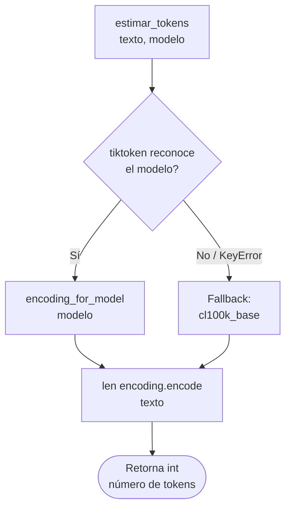
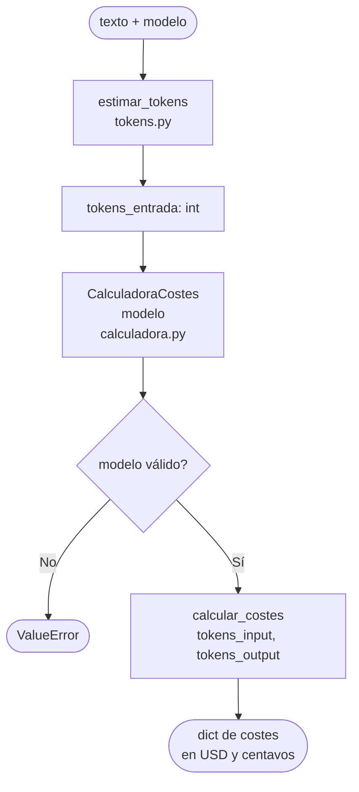

# core/ — Lógica de Negocio

> Capa central de la aplicación. Contiene toda la lógica de cálculo pura.  
> **Regla de oro:** No importa nada de UI, servicios externos ni librerías de presentación.

---

## Índice

1. [Responsabilidad de la capa](#1-responsabilidad-de-la-capa)
2. [precios.py](#2-preciospy)
3. [tokens.py](#3-tokenspy)
4. [calculadora.py](#4-calculadorapy)
5. [Flujo interno del core](#5-flujo-interno-del-core)

---

## 1. Responsabilidad de la capa

```
core/
├── __init__.py
├── precios.py       ← Datos: precios por modelo
├── tokens.py        ← Estimación: cuántos tokens tiene un texto
└── calculadora.py   ← Cálculo: cuánto cuesta una llamada
```

El `core` es completamente **testeable de forma aislada**. Ningún módulo de esta capa debe conocer la existencia de la UI ni de la capa de servicios.

---

## 2. `precios.py`

### Propósito

Define el diccionario `PRECIOS_MODELOS`, que es la fuente de verdad de precios para todos los modelos soportados. Los valores representan **USD por millón de tokens**.

### Estructura

```python
PRECIOS_MODELOS = {
    "gpt-4o":           {"input": 2.50,  "output": 10.00},
    "gpt-4o-mini":      {"input": 0.15,  "output": 0.60},
    "gpt-4-turbo":      {"input": 10.00, "output": 30.00},
    "claude-3-sonnet":  {"input": 3.00,  "output": 15.00},
    "gemini-1.5-flash": {"input": 0.075, "output": 0.30},
    "gemini-1.5-pro":   {"input": 1.25,  "output": 5.00},
}
```

### Tabla de modelos

| Modelo             | Proveedor | Input (USD/M) | Output (USD/M) |
|--------------------|-----------|---------------|----------------|
| `gpt-4o`           | OpenAI    | 2.50          | 10.00          |
| `gpt-4o-mini`      | OpenAI    | 0.15          | 0.60           |
| `gpt-4-turbo`      | OpenAI    | 10.00         | 30.00          |
| `claude-3-sonnet`  | Anthropic | 3.00          | 15.00          |
| `gemini-1.5-flash` | Google    | 0.075         | 0.30           |
| `gemini-1.5-pro`   | Google    | 1.25          | 5.00           |

### Advertencias

> ⚠️ Los precios están **hardcodeados**. Se recomienda migrar a un fichero `precios.json` externo con fecha de última revisión para evitar estimaciones incorrectas cuando los proveedores actualicen tarifas.

---

## 3. `tokens.py`

### Propósito

Estima el número de tokens que ocupa un texto para un modelo dado, usando la librería `tiktoken`.

### Dependencias

```python
import tiktoken
```

### Función: `estimar_tokens`

```
estimar_tokens(texto_usuario: str, modelo: str) -> int
```

| Parámetro       | Tipo  | Descripción                                |
|-----------------|-------|--------------------------------------------|
| `texto_usuario` | `str` | Texto a tokenizar                          |
| `modelo`        | `str` | Nombre del modelo (ej: `"gpt-4o"`)         |

**Retorna:** `int` — número de tokens estimados.

### Flujo de ejecución



### Limitación importante

> ⚠️ `tiktoken` es una librería de **OpenAI**. Los modelos de Anthropic (`claude-*`) y Google (`gemini-*`) no tienen encoding propio en tiktoken, por lo que se usa `cl100k_base` como aproximación. Los valores resultantes son **estimaciones**, no conteos exactos.

---

## 4. `calculadora.py`

### Propósito

Clase encargada de calcular el coste económico de una llamada a API dados los tokens de entrada y salida.

### Clase: `CalculadoraCostes`

```
CalculadoraCostes(modelo: str)
```

| Parámetro | Tipo  | Descripción                                         |
|-----------|-------|-----------------------------------------------------|
| `modelo`  | `str` | Nombre del modelo. Debe existir en `PRECIOS_MODELOS`|

**Constructor — Excepciones:**

| Excepción    | Condición                                        |
|--------------|--------------------------------------------------|
| `ValueError` | Si `modelo` no existe en `PRECIOS_MODELOS`       |

---

### Método: `calcular_costes`

```
calcular_costes(tokens_input: int, tokens_output: int) -> dict
```

| Parámetro       | Tipo  | Descripción                      |
|-----------------|-------|----------------------------------|
| `tokens_input`  | `int` | Tokens de entrada (prompt)       |
| `tokens_output` | `int` | Tokens de salida (respuesta)     |

**Retorna:**

```python
{
    "coste_input_usd":   float,  # Coste de entrada en dólares
    "coste_output_usd":  float,  # Coste de salida en dólares
    "coste_total_usd":   float,  # Coste total en dólares
    "coste_input_cent":  float,  # Coste de entrada en centavos
    "coste_output_cent": float,  # Coste de salida en centavos
    "coste_total_cent":  float,  # Coste total en centavos
}
```

**Fórmula:**

```
coste_input  = (tokens_input  / 1_000_000) × precio["input"]
coste_output = (tokens_output / 1_000_000) × precio["output"]
coste_total  = coste_input + coste_output
coste_*_cent = coste_*_usd × 100
```

---

## 5. Flujo interno del core

