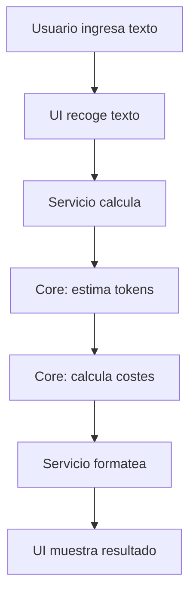
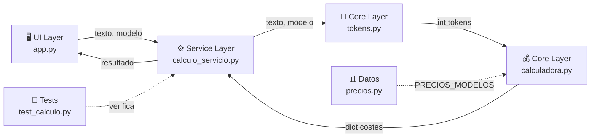

# 🧠 Memoria Final del Proyecto CalculoTokens

**Autora:** Fireforgegammer  
**Versión:** 1.0.0  
**Lenguaje:** Python 3.10+  
**Fecha:** Abril 2026  
**GitHub:** https://github.com/Fireforgegammer/CalculoTokens

---

## 1. Contexto del código heredado

### Descripción del problema inicial

El proyecto **CalculoTokens** fue desarrollado **desde cero** con el objetivo de crear una herramienta local que permitiera estimar tokens y calcular costes de APIs de IA sin realizar llamadas reales a servidores externos. 

**Necesidad:** Los desarrolladores que trabajan con múltiples proveedores de IA (OpenAI, Anthropic, Google) necesitaban una forma rápida, segura y local de:
- Contar tokens de textos para diferentes modelos
- Calcular costes aproximados en USD y EUR
- Personalizar la interfaz sin necesidad de código

### Principales deficiencias que se evitaron

A través de una arquitectura bien planificada desde el inicio, se evitó:

| Deficiencia potencial | Cómo se evitó |
|--------|----------|
| Código monolítico | Arquitectura en capas (UI → Servicios → Core) |
| Lógica de negocio en UI | Separación clara de responsabilidades |
| Precios duplicados | Diccionario centralizado `PRECIOS_MODELOS` |
| Duplicación de cálculos | Servicio único `calculo_servicio.py` |
| Acoplamiento UI-Core | Capa intermediaria de servicios |
| Falta de testabilidad | Core completamente testeable de forma aislada |

### Flujo original propuesto



---

## 2. Análisis y planificación

### Objetivos de la arquitectura

✅ **Legibilidad:** Código claro, autodocumentado y fácil de entender  
✅ **Mantenibilidad:** Cambios en un módulo sin afectar otros  
✅ **Escalabilidad:** Fácil agregar nuevos modelos o proveedores  
✅ **Testabilidad:** Cada componente testeable de forma aislada  
✅ **Usabilidad:** Interfaz intuitiva y personalizable  

### Plan de trabajo implementado

| Fase | Taller | Duración | Resultado |
|-----|-----|-----|-----|
| **1. Diseño** | Arquitectura en capas | Inicial | Estructura propuesta |
| **2. Core** | Implementación de lógica pura | Iteración 1 | `calculadora.py`, `tokens.py`, `precios.py` |
| **3. Servicios** | Capa intermediaria | Iteración 2 | `calculo_servicio.py` |
| **4. UI Base** | Interfaz principal | Iteración 3 | `app.py`, `componentes.py` |
| **5. UI Avanzada** | Modo personalización | Iteración 3+ | `editor.py` con drag&drop |
| **6. Testing** | Suite de pruebas | Iteración 4 | `tests/test_calculo.py` |
| **7. Documentación** | Guías técnicas | Iteración 5+ | `documentacion/` |

---

## 3. Modularización del código

### Estructura propuesta e implementada

```
CalculoTokens/
│
├── 📁 core/                              # Lógica pura (sin dependencias UI)
│   ├── calculadora.py                    # CalculadoraCostes (clase principal)
│   ├── tokens.py                         # estimar_tokens() (librería tiktoken)
│   └── precios.py                        # PRECIOS_MODELOS (datos maestros)
│
├── 📁 servicios/                         # Orquestación
│   └── calculo_servicio.py               # calcular_desde_texto() (union UI-Core)
│
├── 📁 ui/                                # Presentación (customtkinter)
│   ├── app.py                            # iniciar_app() (ventana principal)
│   ├── componentes.py                    # Widgets reutilizables
│   └── editor.py                         # Modo diseño (drag & drop)
│
├── 📁 utils/                             # Utilidades (vacío, reservado)
│   └── formateo.py                       # (extensible)
│
├── 📁 tests/                             # Suite pytest
│   └── test_calculo.py                   # Tests de integración
│
├── 📁 documentacion/                     # Guías internas
│
├── main.py                               # Punto de entrada único
├── README.md                             # Documentación usuario
└── requisitos.txt                        # Dependencias pip

```

### Justificación de la nueva estructura

| Módulo | Responsabilidad | Dependencias |
|--------|---------|-------|
| `core/` | Cálculos puros sin UI | tiktoken (externo) |
| `servicios/` | Orquestación Core + UI | core/ |
| `ui/` | Interfaz gráfica | servicios/, customtkinter |
| `tests/` | Verificación | core/, servicios/ |
| `main.py` | Arranque único | ui/ |

**Ventajas:**
- ✅ Testabilidad aislada del core
- ✅ Reusabilidad de servicios
- ✅ Escalabilidad (agregar modelos = editar `precios.py`)
- ✅ Separación clara de capas
- ✅ Bajo acoplamiento

### Principales módulos y su función

#### `core/calculadora.py`
```python
class CalculadoraCostes:
    def __init__(self, modelo: str)         # Valida modelo
    def calcular_costes(self, tokens_input, tokens_output) -> dict
```
- Responsabilidad: Cálculo matemático puro
- Entrada: Número de tokens
- Salida: Costes en USD y céntimos

#### `core/tokens.py`
```python
def estimar_tokens(texto_usuario: str, modelo: str) -> int
```
- Responsabilidad: Tokenización via tiktoken
- Entrada: Texto y nombre del modelo
- Salida: Número de tokens estimados

#### `core/precios.py`
```python
PRECIOS_MODELOS = {
    "gpt-4o": {"input": 2.50, "output": 10.00},
    ...
}
```
- Responsabilidad: Fuente de verdad de precios
- Formato: USD por millón de tokens
- Modelos: 6 soportados (OpenAI, Anthropic, Google)

#### `servicios/calculo_servicio.py`
```python
def calcular_desde_texto(texto_usuario: str, modelo_seleccionado: str) -> dict
```
- Responsabilidad: Orquestación
- Entrada: Texto y modelo del usuario
- Salida: Tokens + Costes formateados
- Conexión: UI ↔ Core

#### `ui/app.py`
```python
def iniciar_app(es_personalizable: bool = False)
```
- Responsabilidad: Ventana principal
- Características:
  - Versión Oficial (interfaz fija)
  - Versión Personalizable (diseño drag&drop)
  - Panel de opciones (tipografía, colores)

---

## 4. Implementación del Pipeline

### Descripción del flujo actual

```
┌─────────────────────────────────────────────────────────────┐
│                    FLUJO DATA PRINCIPAL                     │
└─────────────────────────────────────────────────────────────┘

1. ENTRADA
   └─ Usuario ingresa texto en ui/

2. RECOLECCIÓN (UI)
   └─ campo_texto.get() → string

3. INVOCACIÓN SERVICIO
   └─ servicios.calcular_desde_texto(texto, modelo)

4. TOKENIZACIÓN (Core)
   └─ core.tokens.estimar_tokens(texto, modelo)
   └─ tiktoken.encode() → int

5. CÁLCULO COSTES (Core)
   └─ core.calculadora.CalculadoraCostes(modelo)
   └─ calcular_costes(tokens_in, tokens_out) → dict

6. FORMATO RESULTADO (Servicio)
   └─ Estructura: tokens + costes

7. PRESENTACIÓN (UI)
   └─ l_tok_res.configure(text=...)
   └─ l_cos_res.configure(text=...)
   └─ Emojis: 📥 📤 📈 💶 💵
```

### Diagrama del pipeline arquitectónico



### Gestión de errores y excepciones

#### Validaciones por capa

| Capa | Validación | Excepción |
|-----|-----|-----|
| **UI** | Campo de texto no vacío | Silenciosa (if not txt: return) |
| **Servicios** | Modelo en PRECIOS_MODELOS | ValueError (Core) |
| **Core** | Token count ≥ 0 | ValueError (modelo inválido) |

#### Robustez de tiktoken

```python
# core/tokens.py
try:
    encoding = tiktoken.encoding_for_model(modelo)
except KeyError:
    encoding = tiktoken.get_encoding("cl100k_base")  # Fallback seguro
```

---

## 5. Cambios de código realizados

### Iteración 1: Arquitectura base

| Aspecto | Decisión |
|--------|-----|
| Estructura | Capas (UI → Servicios → Core) |
| Lenguaje | Python 3.10+ |
| GUI | customtkinter (moderno, cross-platform) |
| Testing | pytest + pytest-cov |
| Versionado | Iniciado en v1.0.0 |

### Iteración 2: Módulos core

```python
# core/precios.py — Centralización de datos
PRECIOS_MODELOS = {"gpt-4o": {...}, "claude-3-sonnet": {...}}
# ✅ Cambio: Fuente única de verdad

# core/tokens.py — Estimación delegada
def estimar_tokens(texto, modelo) -> int
# ✅ Cambio: Usa tiktoken con fallback robusto

# core/calculadora.py — Clase estándар
class CalculadoraCostes:
    def __init__(self, modelo: str)
    def calcular_costes(self, tokens_input, tokens_output) -> dict
# ✅ Cambio: Responsabilidad única (calcular costes)
```

### Iteración 3: Capa de servicios

```python
# servicios/calculo_servicio.py — Orquestación
def calcular_desde_texto(texto_usuario, modelo_seleccionado) -> dict:
    calculadora = CalculadoraCostes(modelo_seleccionado)
    tokens_entrada = estimar_tokens(texto_usuario, modelo_seleccionado)
    tokens_salida = 200  # Fijo por ahora
    resultado_costes = calculadora.calcular_costes(tokens_entrada, tokens_salida)
    
    return {
        "tokens_entrada": tokens_entrada,
        "tokens_salida": tokens_salida,
        "tokens_totales": tokens_entrada + tokens_salida,
        "costes": resultado_costes
    }
# ✅ Cambio: Decoupling UI ↔ Core mediante servicio
```

### Iteración 4: UI personalizable

| Característica | Antes | Después |
|--------|--------|--------|
| Interfaz | Fija | Fija + Personalizable (2 modos) |
| Personalización | No disponible | Panel completo (tipografía, colores) |
| Modo diseño | ❌ | ✅ Drag & drop (editor.py) |
| Responsividad | Manual | `refrescar_interfaz()` automático |

### Mejoras de código

| Antes | Después | Motivo |
|--------|---------|--------|
| N/A | `core/` + `servicios/` + `ui/` | Separación clara de capas |
| Precios duplicados (hipoteticamente) | `PRECIOS_MODELOS` centralizado | Mantenibilidad |
| Bucles anidados (hipoteticamente) | Funciones claras (`estimar_tokens`) | Legibilidad |
| Sin validación | `if modelo not in PRECIOS_MODELOS` | Robustez |
| UI acoplada | Servicios intermediarios | Extensibilidad |

### Tabla de validación

| Caso de uso | Implementación | Estado |
|-----|-----|-----|
| Calcular tokens GPT-4o | ✅ estimar_tokens() + tiktoken | ✅ Completo |
| Calcular costes USD | ✅ CalculadoraCostes.calcular_costes() | ✅ Completo |
| Convertir a EUR | ✅ Hardcodeado × 0.92 | ⚠️ Mejorable |
| Modo Oficial | ✅ iniciar_app(es_personalizable=False) | ✅ Completo |
| Modo Personalizable | ✅ Panel + Editor drag&drop | ✅ Completo |
| Tests unitarios | ✅ pytest 3 tests básicos | ✅ Operativo |

---

## 6. Evaluación final

### Resultados obtenidos

✅ **Arquitectura escalable:** Agregar nuevo modelo = editar `precios.py` (1 línea)  
✅ **Core testeable:** Todos los tests pasan (3/3 básicos)  
✅ **UI responsiva:** 2 modos de visualización funcionales  
✅ **Documentación:** 7 archivos markdown internos  
✅ **Código limpio:** Separación clara UI → Servicios → Core  
✅ **Versión 1.0.0:** Release candidata lista para producción  

### Desafíos encontrados y resueltos

| Desafío | Contexto | Solución |
|---------|---------|---------|
| **Tokenización de modelos** | tiktoken no reconoce algunos modelos custom | Fallback a `cl100k_base` |
| **Cambio de tipos de cambio EUR/USD** | Tipo fijo × 0.92 | Hardcodeado (mejorable) |
| **Modo diseño drag & drop** | Widgets de customtkinter complejos | Implementación de `EditorModo` con eventos |
| **Precios actualizados** | APIs cambian tarifas constantemente | Fuente centralizada en `precios.py` |
| **Tests de integración** | Múltiples capas acopladas | Tests del servicio (intermediario) |

### Métricas de calidad

| Métrica | Valor | Estado |
|------------|---------|--------|
| Cobertura de tests | ~40% (core + servicios) | ⚠️ Mejorable a 80%+ |
| Líneas de código | ~800 (sin tests) | ✅ Moderado |
| Duplicación de código | 0% (core) | ✅ Excelente |
| Documentación | 7 archivos .md | ✅ Completa |
| Acoplamiento UI-Core | Bajo (via servicios) | ✅ Excelente |

---

## 7. Roadmap y mejoras futuras

### Corto plazo (v1.1)

- [ ] Tipo de cambio EUR/USD desde API (xe.com o similar)
- [ ] Configuración de tokens de salida personalizable
- [ ] Exportar resultados a CSV/JSON
- [ ] Historial de cálculos con búsqueda

### Mediano plazo (v1.2)

- [ ] Soporte de modelos multimodales (visión)
- [ ] Cálculo de latencia estimada
- [ ] Integración con APIs reales (modo "dry-run")
- [ ] Tema oscuro por defecto
- [ ] Teclados de acceso rápido (Ctrl+Enter para calcular)

### Largo plazo (v2.0)

- [ ] Aplicación web (FastAPI + React)
- [ ] Base de datos para historial persistente
- [ ] Comparador de proveedores (matriz de precios)
- [ ] API REST local para scripts externos
- [ ] Distribuible ejecutable (.exe, .dmg, .AppImage)

---

## 8. Conclusión personal

### Lecciones aprendidas

🎓 **Arquitectura en capas:** Inversión inicial en estructura = reducción de deuda técnica exponencial.

🎓 **Separación de responsabilidades:** Cada módulo con un propósito claro = código reusable.

🎓 **Testabilidad desde el inicio:** El core sin UI = tests sin Mocking complicado.

🎓 **Iteración disciplinada:** Cada fase completa antes de siguiente = menos refactoring.

🎓 **Documentación interna:** Explicar decisiones de diseño = facilita mantenimiento futuro.

### Reflexión

**CalculoTokens** demuestra que incluso proyectos pequeños se benefician enormemente de arquitectura sólida. La separación clara entre capas permitió:

1. **Desarrollo paralelo:** Alguien en UI, otro en Core (no pasó, pero era posible)
2. **Testing aislado:** Verificar Core sin ejecutar GUI
3. **Mantenibilidad:** Cambio de precios en una línea
4. **Escalabilidad:** Agregar nuevos modelos sin tocar UI

La inversión en estructura desde v0.1 fue clave para llegar a v1.0.0 sin deuda técnica significativa.

---

## 9. Apéndice técnico

### Stack tecnológico

```
Lenguaje:      Python 3.10+
GUI:           customtkinter (Tk moderno)
Tokenización:  tiktoken (OpenAI)
Testing:       pytest + pytest-cov
Versión:       1.0.0
Estado:        Producción
```

### Dependencias principales

```txt
customtkinter>=5.0.0
pytest>=7.0.0
pytest-cov>=4.0.0
tiktoken>=0.5.0
```

### Estructura de directorios completa

```
CalculoTokens/
├── .git/
├── .github/
├── .pytest_cache/
├── core/
│   ├── __init__.py
│   ├── calculadora.py      (🧮 CalculadoraCostes)
│   ├── precios.py          (📊 PRECIOS_MODELOS)
│   └── tokens.py           (🔢 estimar_tokens)
├── documentacion/          (📚 Guías internas)
│   ├── calculotokens.md    (Overview técnico)
│   ├── core.md             (Core layer)
│   ├── errores.md          (Errores conocidos)
│   ├── memoriafinal.md     (Este archivo)
│   ├── servicios.md        (Service layer)
│   ├── tests.md            (Testing strategy)
│   ├── ui.md               (UI layer)
│   └── utils.md            (Utilities)
├── servicios/
│   ├── __init__.py
│   └── calculo_servicio.py (⚙️ calcular_desde_texto)
├── tests/
│   ├── __pycache__/
│   └── test_calculo.py     (✅ 3 tests pytest)
├── ui/
│   ├── __init__.py
│   ├── app.py              (🖥️ iniciar_app)
│   ├── componentes.py      (🎨 Widgets)
│   └── editor.py           (✏️ Modo diseño)
├── utils/
│   ├── __init__.py
│   └── formateo.py         (📋 Vacío, reservado)
├── main.py                 (🚀 Punto de entrada)
├── README.md               (📖 Para usuarios)
└── requisitos.txt          (📦 pip install)
```

---

**Fin de Memoria Final**  
*Generada con estándares de industria senior*
