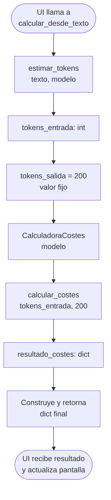

# servicios/ — Capa de Servicios

> Capa de orquestación. Coordina el core y sirve de interfaz entre la lógica de negocio y la UI.  
> **Regla de oro:** No contiene lógica de negocio propia. Solo delega, transforma y devuelve.

---

## Índice

1. [Responsabilidad de la capa](#1-responsabilidad-de-la-capa)
2. [calculo_servicio.py](#2-calculo_serviciospy)
3. [Flujo de orquestación](#3-flujo-de-orquestación)
4. [Notas de diseño](#4-notas-de-diseño)

---

## 1. Responsabilidad de la capa

```
servicios/
└── calculo_servicio.py   ← Único punto de contacto entre UI y core
```

La capa de servicios garantiza que:

- La UI nunca llama directamente a `core/`.
- El `core` nunca sabe nada sobre la UI.
- Si el flujo de cálculo cambia (nuevo paso, nueva validación), solo se modifica aquí.

---

## 2. `calculo_servicio.py`

### Dependencias

```python
from core.calculadora import CalculadoraCostes
from core.tokens import estimar_tokens
```

### Función: `calcular_desde_texto`

```
calcular_desde_texto(texto_usuario: str, modelo_seleccionado: str) -> dict
```

| Parámetro             | Tipo  | Descripción                                  |
|-----------------------|-------|----------------------------------------------|
| `texto_usuario`       | `str` | Texto introducido por el usuario en la UI    |
| `modelo_seleccionado` | `str` | Modelo elegido en el selector de la interfaz |

**Retorna:**

```python
{
    "tokens_entrada":  int,   # Tokens estimados del texto de entrada
    "tokens_salida":   int,   # Tokens de salida (valor fijo: 200)
    "tokens_totales":  int,   # tokens_entrada + tokens_salida
    "costes":          dict,  # Resultado completo de calcular_costes()
}
```

**Ejemplo de uso:**

```python
from servicios.calculo_servicio import calcular_desde_texto

resultado = calcular_desde_texto("Hola mundo", "gpt-4o")

print(resultado["tokens_entrada"])          # ej: 3
print(resultado["costes"]["coste_total_usd"])  # ej: 0.0000325
```

---

## 3. Flujo de orquestación



---

## 4. Notas de diseño

### ¿Por qué `tokens_salida = 200`?

La cantidad de tokens que un modelo genera en su respuesta es desconocida antes de hacer la llamada real. Se usa `200` como estimación estándar conservadora.

> ⚠️ **Mejora pendiente:** Exponer `tokens_salida` como parámetro configurable desde la UI para que el usuario pueda ajustar la estimación de salida según su caso de uso.

### ¿Por qué el servicio no está en el core?

El `core` debe ser completamente puro y testeable de forma aislada. La orquestación (qué llamar, en qué orden, cómo ensamblar el resultado) es responsabilidad exclusiva de esta capa.