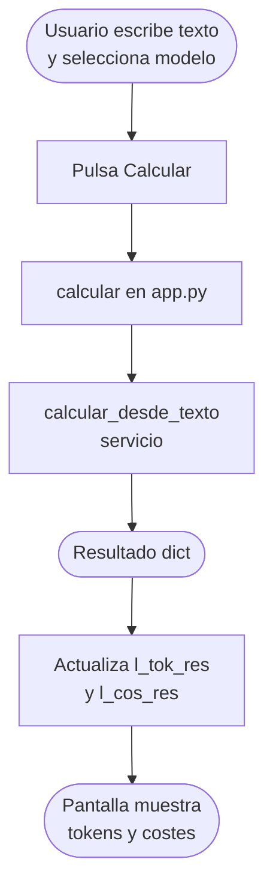
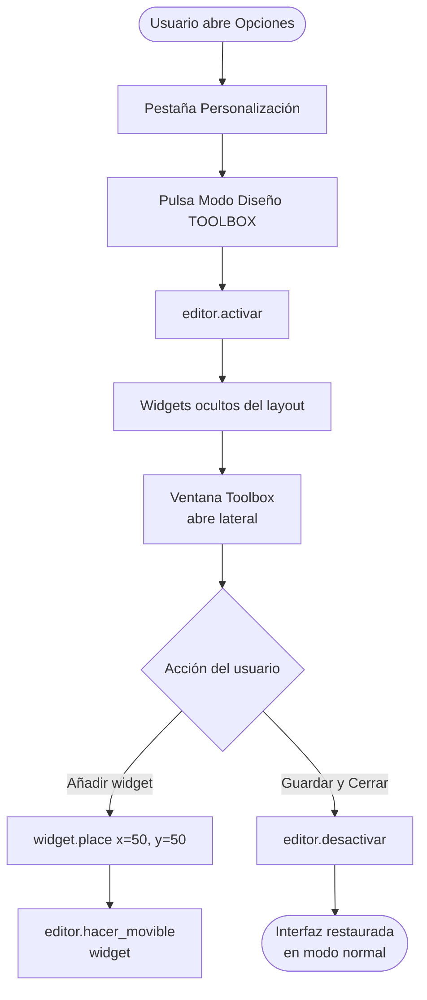

# ui/ — Capa de Presentación (GUI)

> Capa de interfaz gráfica construida con `customtkinter`.  
> **Regla de oro:** No contiene lógica de negocio. Solo recoge input del usuario, llama a servicios y pinta resultados.

---

## Índice

1. [Responsabilidad de la capa](#1-responsabilidad-de-la-capa)
2. [app.py — Ventana principal](#2-apppy--ventana-principal)
3. [componentes.py — Widgets reutilizables](#3-componentespy--widgets-reutilizables)
4. [editor.py — Modo diseño](#4-editorpy--modo-diseño)
5. [Flujos de la interfaz](#5-flujos-de-la-interfaz)

---

## 1. Responsabilidad de la capa

```
ui/
├── __init__.py
├── app.py           ← Ventana principal y lógica de presentación
├── componentes.py   ← Widgets reutilizables (secciones, botones)
└── editor.py        ← Modo diseño drag & drop
```

La UI solo conoce la capa de servicios. Nunca llama directamente al `core`.

---

## 2. `app.py` — Ventana principal

### Función: `iniciar_app`

```
iniciar_app(es_personalizable: bool = False) -> None
```

| Parámetro           | Tipo   | Descripción                                            |
|---------------------|--------|--------------------------------------------------------|
| `es_personalizable` | `bool` | `True` activa el botón ⚙ Opciones y el modo diseño    |

Construye la ventana CTk principal (`900×950px`, tema light) y monta todos los widgets.

---

### Widgets de la ventana principal

| Variable      | Tipo          | Descripción                                           |
|---------------|---------------|-------------------------------------------------------|
| `l_mod_t`     | `CTkLabel`    | Etiqueta "Modelo de IA"                               |
| `sel_mod`     | `CTkComboBox` | Selector de modelo (cargado desde `PRECIOS_MODELOS`)  |
| `l_txt_t`     | `CTkLabel`    | Etiqueta "Texto a analizar"                           |
| `campo_texto` | `CTkTextbox`  | Área multilinea para introducir el texto              |
| `f_btns`      | `CTkFrame`    | Contenedor horizontal de botones                      |
| `b_calc`      | `CTkButton`   | Botón "Calcular"                                      |
| `b_limp`      | `CTkButton`   | Botón "Limpiar"                                       |
| `b_salir`     | `CTkButton`   | Botón "Salir"                                         |
| `b_opciones`  | `CTkButton`   | Botón "⚙ Opciones" _(solo modo personalizable)_       |
| `f_tok`       | `CTkFrame`    | Sección visual de resultados de tokens                |
| `l_tok_res`   | `CTkLabel`    | Etiqueta con resultado de tokens                      |
| `f_cos`       | `CTkFrame`    | Sección visual de resultados de costes                |
| `l_cos_res`   | `CTkLabel`    | Etiqueta con resultado de costes                      |

---

### Función interna: `calcular()`

Recoge el texto del área de entrada, llama al servicio y actualiza los resultados en pantalla.

**Formato de salida — Tokens:**
```
📥 In: {tokens_entrada} | 📤 Out: {tokens_salida} | 📈 Tot: {tokens_totales}
```

**Formato de salida — Costes:**
```
💶 €: {coste_total_usd × 0.92:.6f} | 💵 $: {coste_total_usd:.6f}
```

> ℹ️ El tipo de cambio EUR/USD (`× 0.92`) está hardcodeado. Se recomienda hacerlo configurable.

---

### Función interna: `refrescar_interfaz()`

Aplica la fuente y tamaño de texto actuales a todos los widgets. Se llama automáticamente al cambiar cualquier ajuste visual desde el panel de opciones.

---

### Panel de opciones (`abrir_opciones()`) — solo modo personalizable

Abre una ventana `CTkToplevel` con 4 pestañas:

| Pestaña             | Contenido                                                        |
|---------------------|------------------------------------------------------------------|
| Ajustes Visuales    | Selector de tipografía (`Segoe UI Emoji`, `Arial`, etc.) y tamaño |
| Colores Fondos      | Color de fondo de la app, sección tokens y sección costes        |
| Colores Ventanas    | Color interior de las cajas de tokens, costes y global           |
| Personalización     | Toggle Light/Dark mode + acceso al Modo Diseño (Toolbox)        |

---

## 3. `componentes.py` — Widgets reutilizables

### Función: `crear_seccion`

```
crear_seccion(master, titulo, color_fondo, fuente_tit, fuente_res)
    -> tuple[CTkFrame, CTkLabel]
```

| Parámetro     | Tipo    | Descripción                              |
|---------------|---------|------------------------------------------|
| `master`      | widget  | Widget padre donde se monta la sección   |
| `titulo`      | `str`   | Texto del encabezado de la sección       |
| `color_fondo` | `str`   | Color hex del frame exterior             |
| `fuente_tit`  | `tuple` | Fuente del título                        |
| `fuente_res`  | `tuple` | Fuente de la etiqueta de resultado       |

**Retorna:** `(frame_fondo, label_resultado)`

Estructura visual generada:

```
┌─────────────────────────────────┐  ← frame_fondo (color_fondo)
│  Titulo                         │
│ ┌─────────────────────────────┐ │  ← frame_interior (blanco)
│ │  [label_resultado]          │ │
│ └─────────────────────────────┘ │
└─────────────────────────────────┘
```

---

### Función: `crear_boton_estilizado`

```
crear_boton_estilizado(master, texto, comando, color, fuente) -> CTkButton
```

| Parámetro | Tipo       | Descripción                          |
|-----------|------------|--------------------------------------|
| `master`  | widget     | Widget padre                         |
| `texto`   | `str`      | Texto del botón                      |
| `comando` | `callable` | Función a ejecutar al pulsar         |
| `color`   | `str`      | Color hex del fondo del botón        |
| `fuente`  | `tuple`    | Fuente del texto                     |

**Estilo fijo:** `corner_radius=8`, `height=42`, `width=150`, `hover_color="#34495e"`.

---

## 4. `editor.py` — Modo diseño

### Clase: `EditorModo`

Implementa el modo de edición visual drag & drop disponible en la Versión Personalizable.

```
EditorModo(layout: CTkFrame, ventana: CTk)
```

| Atributo    | Tipo        | Descripción                                  |
|-------------|-------------|----------------------------------------------|
| `layout`    | `CTkFrame`  | Frame principal de la aplicación             |
| `ventana`   | `CTk`       | Ventana raíz                                 |
| `activo`    | `bool`      | Estado del modo edición                      |
| `drag_data` | `dict`      | Estado del arrastre `{widget, x, y}`         |

---

### Métodos públicos

| Método                  | Descripción                                                    |
|-------------------------|----------------------------------------------------------------|
| `activar()`             | Activa el modo diseño                                          |
| `desactivar()`          | Desactiva el modo y restaura el estado interactivo de widgets  |
| `hacer_movible(widget)` | Convierte un widget en arrastrable y redimensionable           |

---

### Interacciones disponibles en modo diseño

| Gesto                        | Resultado                           |
|------------------------------|-------------------------------------|
| `Click izq. + arrastrar`     | Mueve el widget por la ventana      |
| `Click der. + arrastrar`     | Redimensiona el widget              |

---

### Métodos privados

| Método                        | Descripción                                              |
|-------------------------------|----------------------------------------------------------|
| `_aplicar_escudo_total(w, p)` | Deshabilita interacción y vincula eventos de drag/resize |
| `_set_estado_interactivo(w, s)` | Restaura o deshabilita el estado de widgets hijos      |
| `_inicio_dr(e, w)`            | Inicia el arrastre: guarda posición inicial              |
| `_movimiento_dr(e, w)`        | Mueve el widget con `place(x, y)` según delta            |
| `_fin_dr()`                   | Limpia el estado de arrastre                             |
| `_inicio_rs(e, w)`            | Inicia el redimensionado: guarda posición inicial        |
| `_movimiento_rs(e, w)`        | Aplica nuevo `width` y `height` según delta              |

---

## 5. Flujos de la interfaz

### Flujo principal de cálculo



### Flujo del Modo Diseño

